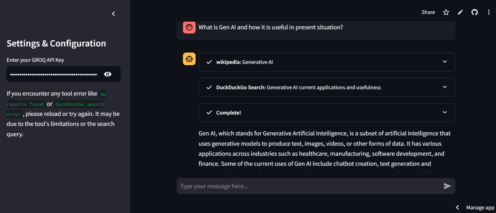
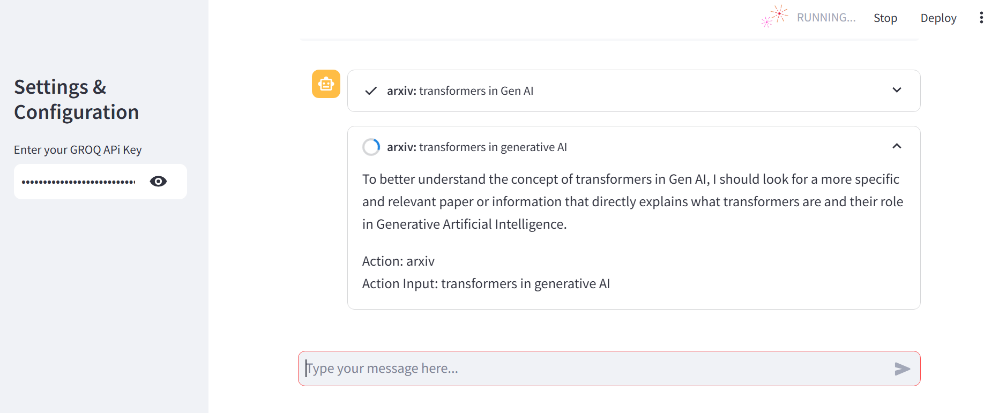
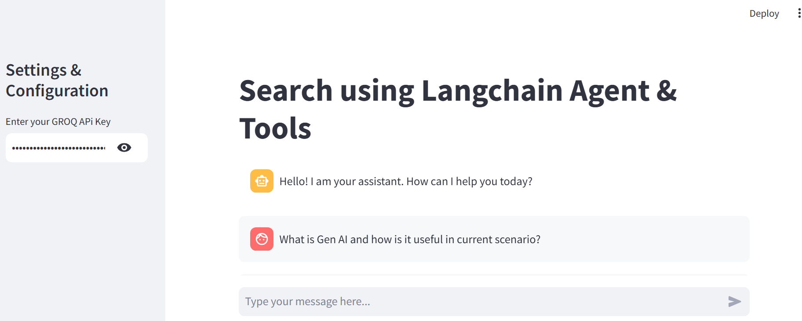
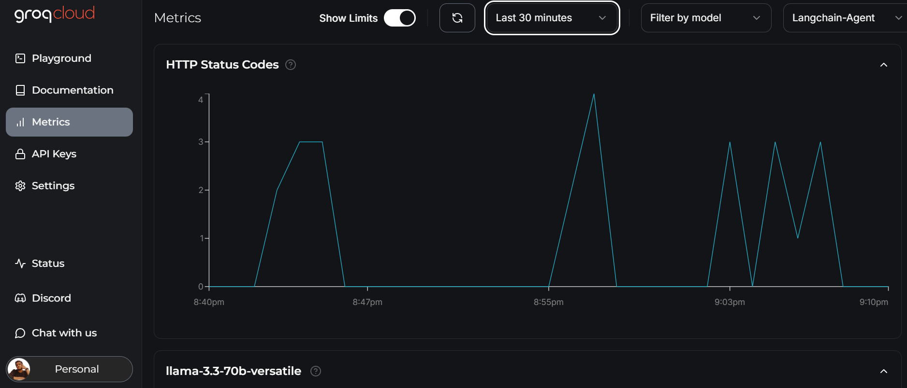
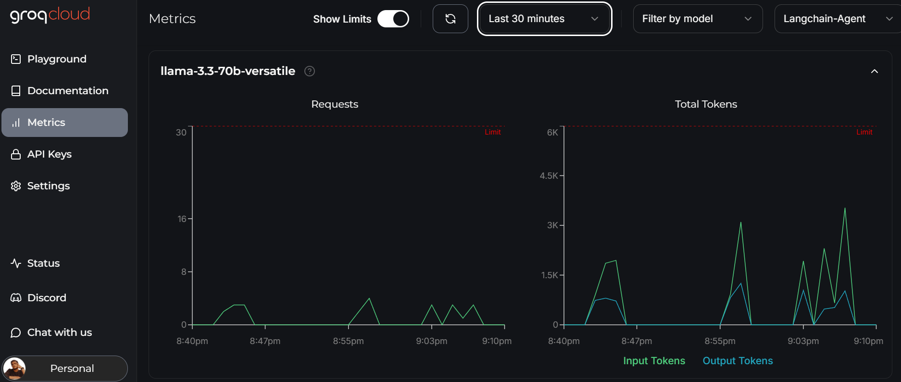

# 🌐 Information Retrieval App using Langchain Agent & Tools

## 🚀 Project Overview
This project is a **Streamlit-based web application** that integrates with LangChain tools to provide users with efficient, multi-source information retrieval. It allows users to interact with a conversational chatbot that processes natural language queries and retrieves information from multiple sources, including:

- **Academic papers via ArXiv**
- **Wikipedia articles**
- **General web search results using DuckDuckGo**

By leveraging the GROQ-powered large language model (LLM), the app ensures intelligent and detailed responses within a user-friendly interface. It's designed for researchers, students, and professionals seeking comprehensive knowledge discovery.

---

## ✨ Features

- **🗣 Conversational Interface**: Natural language interaction for queries and responses.
- **🔍 Multi-Source Search Tools**:
  - **ArXiv API**: Summarizes academic papers.
  - **Wikipedia API**: Fetches concise article summaries.
  - **DuckDuckGo API**: Conducts comprehensive web searches.
- **⚙️ Streamlit Sidebar**: Input API keys and configure settings securely.
- **📜 Chat History Management**: Maintains a dynamic record of user queries and responses.
- **🤖 LLM Integration**: Powered by GROQ API for advanced natural language processing.

---

## 📂 Project Structure

```
📂 Project Folder
├── app.py                  # Main entry point for Streamlit
├── .env                    # To store the API keys
├── requirements.txt        # Dependencies for the app
├── Dockerfile              # For Docker containerization
└── README.md               # Project documentation
```

---


### Steps

1. **Clone the Repository**:
   ```bash
   git clone https://github.com/kiran-91/Information-Retrieval-App-using-Langchain-Agent-Tools.git
   cd Information-Retrieval-App-using-Langchain-Agent-Tools
   ```

2. **Set Up a Virtual Environment**:
   ```bash
   python -m venv venv
   source venv/bin/activate  # Linux/MacOS
   venv\Scripts\activate  # Windows
   ```

3. **Install Dependencies**:
   ```bash
   pip install -r requirements.txt
   ```

4. **Configure Environment Variables**:
   Create a `.env` file and add the following:
   ```env
   GROQ_API_KEY=<Your GROQ API Key>
   HF_API_KEY=<Your HuggingFace API Key>
   ```

5. **Run the Application**:
   ```bash
   streamlit run app.py
   ```

---

## 📊 Results
If you're on Team Lazy like me and would rather skip all the tasks, no worries—just kick back and check out the Streamlit app right here!

👉 **[LangChain Agent Streamlit App](https://langchainagent.streamlit.app/)**

---

## 🌟 How It Works

### 1. **API Integration**
- **ArXiv**: Fetches academic papers based on user queries.
- **Wikipedia**: Summarizes articles with concise and relevant details.
- **DuckDuckGo**: Conducts web searches for broader information.

### 2. **Streamlit Interface**
- A sidebar lets users securely input API keys.
- A main chat interface provides conversational interactions.

### 3. **LLM and LangChain Agent**
- The `ChatGroq` LLM processes user queries.
- LangChain agents combine multiple tools for a seamless experience.

### 4. **Dynamic Interaction**
- User inputs are handled via `st.chat_input`.
- Responses are dynamically displayed and stored in chat history.

---

## 📸 Screenshots







---

## 📜 License
This project is licensed under the **GNU General Public License v3**. See the `LICENSE` file for details.

---

## 🙌 Acknowledgments

- [LangChain](https://www.langchain.com/): Framework for tool and LLM integration.
- [Streamlit](https://streamlit.io/): For fast, interactive app development.
- [GROQ API](https://www.groq.com/): For enabling advanced LLM responses.
- [ArXiv](https://arxiv.org/): Academic paper repository.
- [Wikipedia](https://www.wikipedia.org/): Article summaries.
- [DuckDuckGo](https://duckduckgo.com/): Web search integration.

---

## 📧 Contact
For questions or contributions, feel free to connect!

